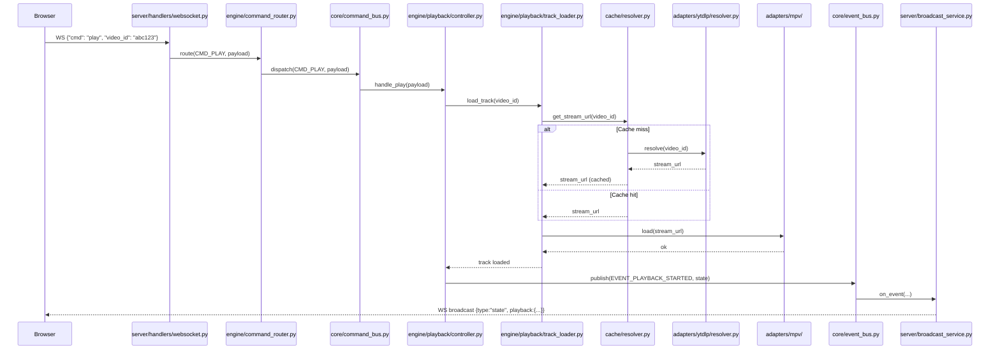
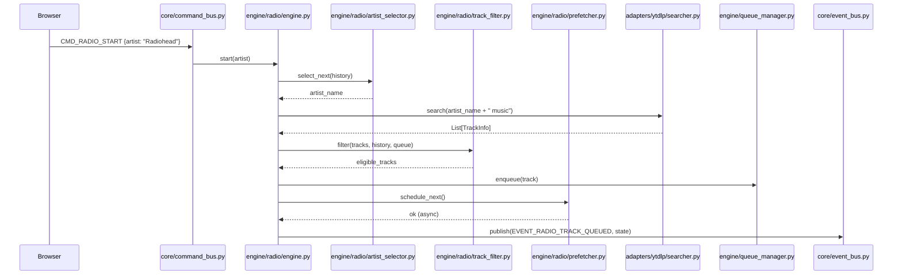
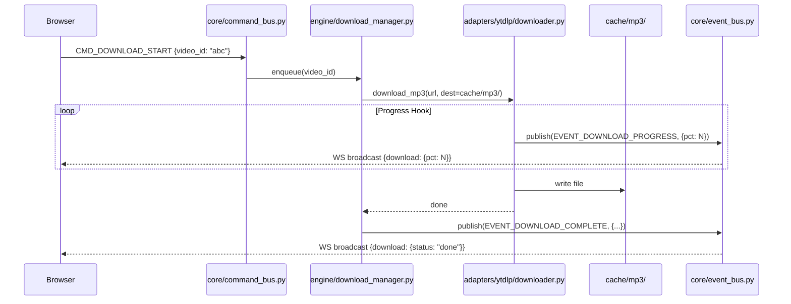
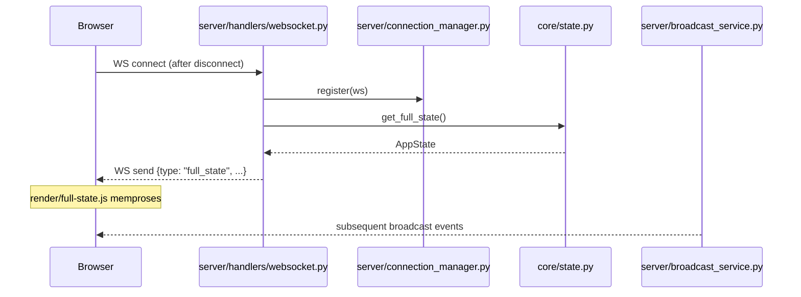

# Data Flow

← [architecture/overview.md](overview.md) | [Blueprint.md](../Blueprint.md)

---

## Gambaran Umum

LunaWave menggunakan dua jalur komunikasi utama:

- **WebSocket** — aksi real-time (play, pause, queue) dan state broadcast ke frontend
- **HTTP** — auth, file statis, status endpoint

State selalu mengalir dari server ke client, bukan sebaliknya. Client tidak boleh menyimpan state kanonik — hanya boleh melakukan optimistic update sementara menunggu konfirmasi dari server.

---

## Flow 1 — User Play Track



---

## Flow 2 — Radio Mode



> `track_filter.py` adalah titik rawan bug radio mode. Lihat → [backend/services.md](../backend/services.md)

---

## Flow 3 — Download MP3



---

## Flow 4 — WebSocket Reconnect



---

## Aliran Data Persistensi

```
TrackInfo (dari yt-dlp)
        │
        ▼
persistence/track_repo.py
        │
        ├─── SQLite lunawave.db
        │
        └─── artists_enriched.json   ← data statis artis, bukan runtime
```

Cache URL stream (sementara):
```
adapters/ytdlp/resolver.py
        │
        ▼
cache/resolver.py   (in-memory + optional SQLite TTL cache)
```

---

## State yang Dikirim ke Frontend

Setiap broadcast WebSocket membawa snapshot state partial atau full:

```json
{
  "type": "state",
  "playback": {
    "status": "playing",
    "position": 42.5,
    "duration": 243.0,
    "track": { "video_id": "abc", "title": "...", "artist": "..." }
  },
  "queue": [...],
  "volume": 75,
  "mode": "radio",
  "downloads": [{ "video_id": "xyz", "pct": 63 }]
}
```

Detail serialisasi → [backend/api.md](../backend/api.md)

---

## Dokumen Terkait

- [architecture/layer_diagram.md](layer_diagram.md) — Diagram layer & dependency
- [architecture/domain.md](domain.md) — Event & Command system
- [backend/api.md](../backend/api.md) — Format pesan WS & HTTP
- [frontend/state_management.md](../frontend/state_management.md) — Bagaimana frontend memproses state
- [ADR-0005](../adr/0005-websocket-single-channel.md) — Kenapa satu channel WS?
