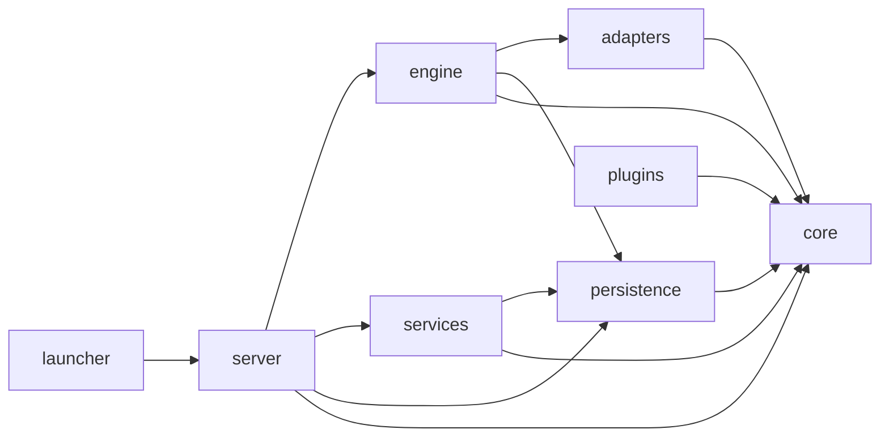

# Dependency Rules

← [architecture/overview.md](overview.md) | [Blueprint.md](../Blueprint.md)

---

## Aturan Arah Dependency

Aturan ini adalah **law**, bukan guideline. Dilanggar = CI merah.

```
core/           → tidak boleh import apapun di luar core/
adapters/       → boleh import core/ saja
persistence/    → boleh import core/ saja
plugins/        → boleh import core/ saja
engine/         → boleh import core/, adapters/, persistence/ (lewat ports)
services/       → boleh import core/, persistence/
server/         → boleh import core/, engine/, services/, persistence/
launcher/       → boleh import server/ (untuk start saja)
```

**Tidak boleh:**
- `core/` import dari `engine/`, `adapters/`, `server/`, dsb.
- `adapters/` import dari `engine/` atau `server/`
- `plugins/` import dari `engine/` atau `server/`
- `persistence/` import dari `engine/` atau `server/`

---

## Diagram Arah Dependency



Panah = "boleh import dari". Tidak ada panah balik.

---

## Penegakan via `.importlinter`

File `.importlinter` di root repo mendefinisikan contract yang sama:

```ini
[importlinter]
root_packages =
    core
    adapters
    engine
    persistence
    server
    services
    plugins
    launcher

[importlinter:contract:core-is-independent]
name = core must not import from other packages
type = independence
modules = core

[importlinter:contract:adapters-only-import-core]
name = adapters can only import from core
type = layers
layers =
    adapters
    core

[importlinter:contract:persistence-only-import-core]
name = persistence can only import from core
type = layers
layers =
    persistence
    core

[importlinter:contract:engine-layer]
name = engine layer order
type = layers
layers =
    engine
    adapters | persistence | core

[importlinter:contract:server-is-top]
name = server is the top layer
type = layers
layers =
    server
    engine | services | persistence | core
```

---

## Cara Menjalankan

```bash
# Manual
lint-imports

# Atau via pre-commit (otomatis saat git commit)
pre-commit run import-linter --all-files

# Atau via CI (otomatis)
# Lihat → devops/ci_cd.md
```

---

## Mengapa Aturan Ini Penting

Tanpa aturan ini, codebase cenderung menjadi **big ball of mud** — semua import semua. Ketika itu terjadi:

- Tidak ada bagian yang bisa di-test secara terisolasi
- Setiap perubahan berpotensi break bagian yang tidak terduga
- Onboarding baru menjadi sangat sulit

Dengan aturan ini:
- `core/` dapat di-test sepenuhnya tanpa mock apapun
- Adapter dapat diganti (contoh: ganti MPV dengan VLC) tanpa menyentuh domain
- Engine dapat di-test dengan fake adapter, tanpa perlu MPV nyata

---

## Dokumen Terkait

- [architecture/domain.md](domain.md) — Port & Protocol definitions
- [devops/tooling.md](../devops/tooling.md) — Setup `.importlinter` dan `pre-commit`
- [devops/ci_cd.md](../devops/ci_cd.md) — CI pipeline yang menjalankan `lint-imports`
- [ADR-0003](../adr/0003-hexagonal-ports-protocol.md) — Alasan hexagonal architecture
