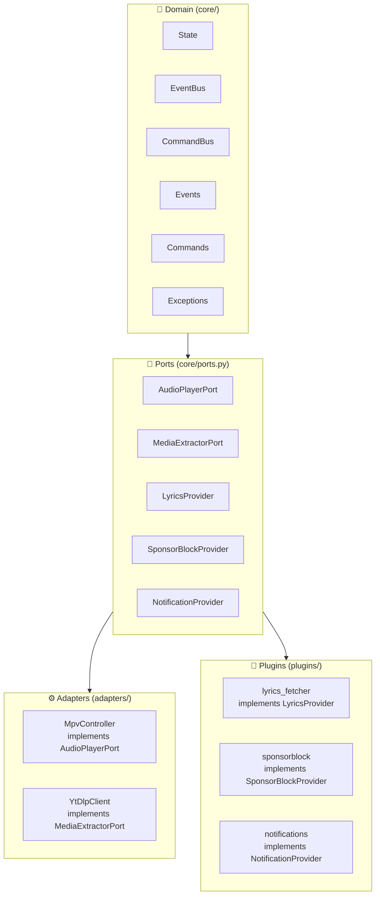

# Domain Model

← [architecture/overview.md](overview.md) | [Blueprint.md](../Blueprint.md)

---

## Hexagonal Architecture di LunaWave

LunaWave mengikuti pola **ports & adapters** (hexagonal architecture). Domain logic murni di tengah, sistem eksternal di pinggir. Tidak ada satu baris kode domain yang bergantung langsung pada MPV, yt-dlp, SQLite, atau FastAPI.

Keputusan ini didokumentasikan di → [ADR-0003](../adr/0003-hexagonal-ports-protocol.md)

---

## Diagram Domain



---

## Port Definitions

Semua port didefinisikan di `core/ports.py` sebagai Python `Protocol`.

### `AudioPlayerPort`

```python
class AudioPlayerPort(Protocol):
    async def load(self, url: str) -> None: ...
    async def play(self) -> None: ...
    async def pause(self) -> None: ...
    async def stop(self) -> None: ...
    async def seek(self, position: float) -> None: ...
    async def set_volume(self, volume: int) -> None: ...
    async def get_position(self) -> float: ...
    async def get_duration(self) -> float: ...
```

Implementasi: `adapters/mpv/` → `MpvController`

---

### `MediaExtractorPort`

```python
class MediaExtractorPort(Protocol):
    async def search(self, query: str) -> list[TrackInfo]: ...
    async def get_stream_url(self, video_id: str) -> str: ...
    async def download_mp3(self, url: str, dest: Path) -> None: ...
```

Implementasi: `adapters/ytdlp/` → `YtDlpClient`

---

### `LyricsProvider`

```python
class LyricsProvider(Protocol):
    async def fetch(self, title: str, artist: str) -> LyricsResult | None: ...
```

Implementasi: `plugins/lyrics_fetcher.py`

---

### `SponsorBlockProvider`

```python
class SponsorBlockProvider(Protocol):
    async def get_segments(self, video_id: str) -> list[Segment]: ...
```

Implementasi: `plugins/sponsorblock.py`

---

### `NotificationProvider`

```python
class NotificationProvider(Protocol):
    def notify(self, title: str, body: str, icon: str | None = None) -> None: ...
```

Implementasi: `plugins/notifications.py`

---

## Domain Objects

### `TrackInfo`

Data object murni, tidak ada method yang memanggil I/O.

```python
@dataclass(frozen=True)
class TrackInfo:
    video_id: str
    title: str
    artist: str
    duration: int          # detik
    thumbnail_url: str
    stream_url: str | None = None
```

### `State`

State global aplikasi yang disimpan di `core/state.py`. Merupakan satu-satunya state yang dikirim ke frontend via WebSocket.

```python
@dataclass
class AppState:
    playback: PlaybackState
    queue: list[TrackInfo]
    volume: int
    mode: PlayMode         # NORMAL | RADIO | SHUFFLE
    radio: RadioState | None
    downloads: list[DownloadJob]
```

### `PlayMode`

```python
class PlayMode(Enum):
    NORMAL = "normal"
    RADIO = "radio"
    SHUFFLE = "shuffle"
```

---

## Event System

Event dikirim via `core/event_bus.py`. Engine publish event, server layer subscribe dan broadcast ke frontend.

### Event Utama

| Event | Publisher | Subscriber |
|---|---|---|
| `EVENT_PLAYBACK_STARTED` | `playback/controller.py` | `broadcast_service.py` |
| `EVENT_PLAYBACK_PAUSED` | `playback/controller.py` | `broadcast_service.py` |
| `EVENT_PLAYBACK_STOPPED` | `playback/controller.py` | `broadcast_service.py` |
| `EVENT_TRACK_CHANGED` | `playback/controller.py` | `broadcast_service.py`, `lyrics_sync.py` |
| `EVENT_QUEUE_UPDATED` | `queue_manager.py` | `broadcast_service.py` |
| `EVENT_DOWNLOAD_PROGRESS` | `download_manager.py` | `broadcast_service.py` |
| `EVENT_POSITION_CHANGED` | `adapters/mpv/observer.py` | `playback/controller.py` |
| `EVENT_RADIO_TRACK_QUEUED` | `radio/engine.py` | `broadcast_service.py` |

Alasan single-writer command bus → [ADR-0004](../adr/0004-command-bus-single-writer.md)

---

## Command System

Semua aksi user masuk lewat `core/command_bus.py`. Tidak ada shortcut ke engine.

### Command Utama

| Command | Handler |
|---|---|
| `CMD_PLAY` | `playback/controller.py` |
| `CMD_PAUSE` | `playback/controller.py` |
| `CMD_SKIP_NEXT` | `playback/controller.py` |
| `CMD_SKIP_PREV` | `playback/controller.py` |
| `CMD_SEEK` | `playback/controller.py` |
| `CMD_SET_VOLUME` | `volume_service.py` |
| `CMD_QUEUE_ADD` | `queue_manager.py` |
| `CMD_QUEUE_REMOVE` | `queue_manager.py` |
| `CMD_QUEUE_REORDER` | `queue_manager.py` |
| `CMD_RADIO_START` | `radio/engine.py` |
| `CMD_DOWNLOAD_START` | `download_manager.py` |
| `CMD_DOWNLOAD_CANCEL` | `download_manager.py` |
| `CMD_SEARCH` | `discover_service.py` |

---

## Fake Implementations (untuk testing)

Semua port memiliki fake di `tests/fakes/` untuk kebutuhan unit test.

| Port | Fake |
|---|---|
| `AudioPlayerPort` | `tests/fakes/fake_audio_player.py` |
| `MediaExtractorPort` | `tests/fakes/fake_media_extractor.py` |
| `LyricsProvider` | `tests/fakes/fake_lyrics_provider.py` |
| `SponsorBlockProvider` | `tests/fakes/fake_sponsorblock_provider.py` |

Detail → [testing/unit_testing.md](../testing/unit_testing.md)

---

## Dokumen Terkait

- [architecture/dependency_rules.md](dependency_rules.md) — Aturan import antar layer
- [architecture/data_flow.md](data_flow.md) — Bagaimana data mengalir dari user ke MPV
- [backend/services.md](../backend/services.md) — Implementasi engine
- [ADR-0003](../adr/0003-hexagonal-ports-protocol.md) — Keputusan hexagonal architecture
