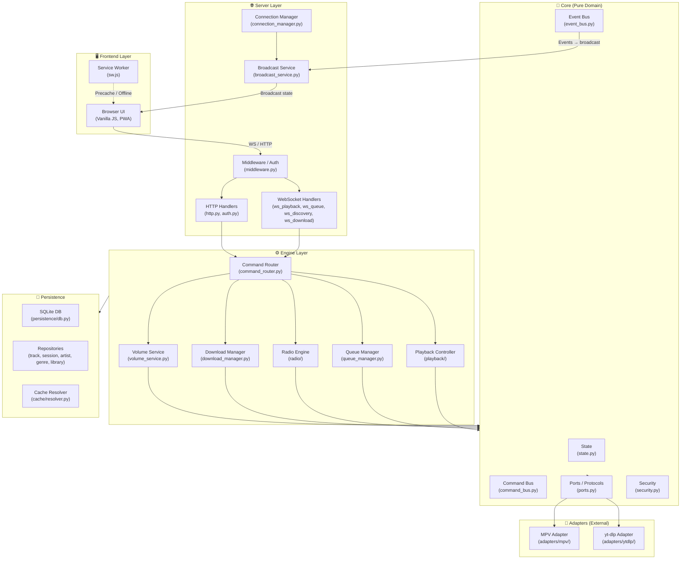
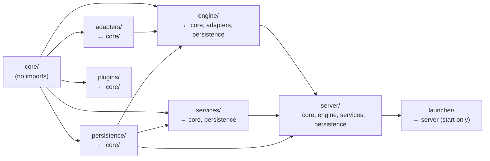
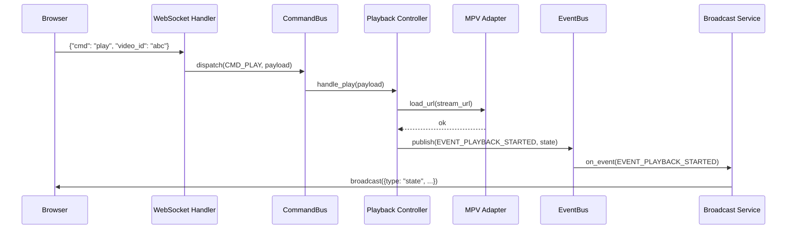
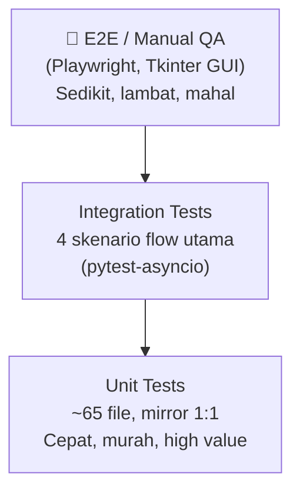
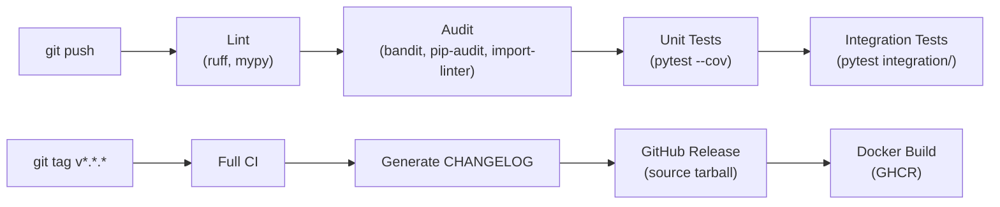

# Layer Diagram

← [architecture/overview.md](overview.md) | [Blueprint.md](../Blueprint.md)

---

## Layer Architecture

---

## Dependency Graph

Aturan lengkap → [architecture/dependency_rules.md](dependency_rules.md)

---

## Request Flow — User Play Track

---

## Testing Pyramid

Detail → [testing/testing_strategy.md](../testing/testing_strategy.md)

---

## Build & Release Flow

Detail → [devops/release.md](../devops/release.md)

---

## Folder Hierarchy (Ringkas)

```mermaid
graph TD
    root["lunawave/"]
    root --> core["core/ — pure domain"]
    root --> adapters["adapters/ — external systems"]
    root --> engine["engine/ — domain logic"]
    root --> persistence["persistence/ — SQLite repos"]
    root --> server["server/ — API layer"]
    root --> plugins["plugins/ — optional features"]
    root --> launcher["launcher/ — GUI & process"]
    root --> cache["cache/ — file cache"]
    root --> scripts["automation/ — tooling"]
    root --> data["data/ — static data"]
    root --> tests["tests/ — all tests"]
    root --> web["web/static/ — frontend"]
    root --> docs["docs/ — documentation"]
```

Tree lengkap → [architecture/folder_structure.md](folder_structure.md)
