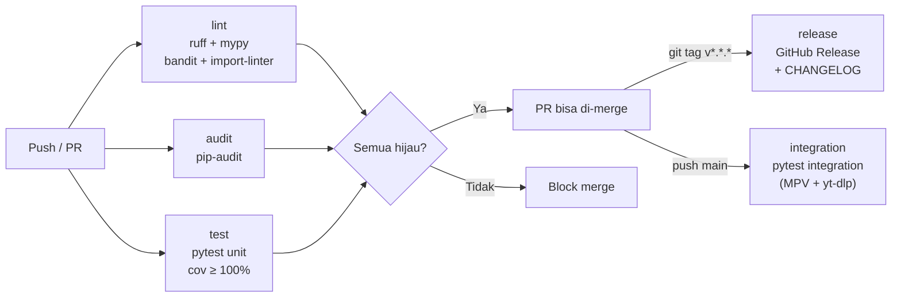

# CI/CD

> Dokumentasi GitHub Actions CI pipeline LunaWave — kondisi saat ini, gap yang ada, dan target pipeline impian.
> Untuk konfigurasi tooling yang dijalankan CI, lihat → [tooling.md](tooling.md)
> Untuk release workflow, lihat → [release.md](release.md)

---

## Status CI Saat Ini

CI saat ini (`ci.yml`) mereferensikan hal yang belum ada di repo:

| CI Mereferensikan | Status | Aksi |
|---|---|---|
| `requirements-dev.txt` | ❌ Tidak ada | Buat — lihat [packaging.md](packaging.md) |
| `pyproject.toml` (config bandit, coverage, mypy) | ❌ Tidak ada | Buat — lihat [tooling.md](tooling.md) |
| `tests/` folder | ⚠️ 0 file test | Isi bertahap — lihat [../testing/unit_testing.md](../testing/unit_testing.md) |
| `tests/unit/web/` (step S02-056) | ❌ Tidak ada | Ganti jadi `tests/frontend/` atau hapus step ini |

> **Catatan:** CI yang referensi artefak tidak ada akan gagal di step pertama (`pip install -r requirements-dev.txt`). Ini kesan yang berlawanan dari tujuan CI — seorang engineer yang baru buka repo akan langsung melihat pipeline merah, bukan hijau.

---

## Opsi Jujur Sementara

Sambil artefak yang direferensikan belum tersedia, ada dua pilihan:

### Opsi A: `continue-on-error: true`

```yaml
# .github/workflows/ci.yml
jobs:
  test:
    steps:
      - name: Install dev dependencies
        run: pip install -r requirements-dev.txt
        continue-on-error: true   # ← jujur: ini belum siap

      - name: Run tests
        run: pytest tests/unit/ -v --cov
        continue-on-error: true   # ← idem
```

Tambahkan komentar di tiap step dengan `continue-on-error`:
```yaml
# TODO: hapus continue-on-error setelah requirements-dev.txt dibuat
```

Catat di `docs/PATCHLOG.md` bahwa step ini sengaja tidak-blocking sementara.

### Opsi B: Turunkan Klaim CI

Hapus sementara step yang belum bisa jalan, sisakan hanya step yang sudah jalan:

```yaml
jobs:
  lint-only:
    steps:
      - name: Ruff lint
        run: pip install ruff && ruff check .
      # test steps dihapus sampai tests/ ada
```

> **Rekomendasi:** Opsi A lebih jujur dan lebih aman — pipeline tetap jalan, gap terlihat jelas di log, dan tidak ada informasi yang tersembunyi.

---

## Target CI Pipeline (Impian)

```yaml
# .github/workflows/ci.yml
name: CI

on:
  push:
    branches: [main, develop]
  pull_request:
    branches: [main]

jobs:
  lint:
    name: Lint & Type Check
    runs-on: ubuntu-latest
    steps:
      - uses: actions/checkout@v4
      - uses: actions/setup-python@v5
        with:
          python-version: "3.11"
      - run: pip install -r requirements-dev.txt
      - run: ruff check .
      - run: ruff format --check .
      - run: mypy . --config-file pyproject.toml
      - run: bandit -r lunawave/ -c pyproject.toml
      - run: lint-imports

  audit:
    name: Security & Dependency Audit
    runs-on: ubuntu-latest
    steps:
      - uses: actions/checkout@v4
      - uses: actions/setup-python@v5
        with:
          python-version: "3.11"
      - run: pip install pip-audit
      - run: pip-audit -r requirements.txt

  test:
    name: Unit Tests
    runs-on: ubuntu-latest
    steps:
      - uses: actions/checkout@v4
      - uses: actions/setup-python@v5
        with:
          python-version: "3.11"
      - run: pip install -r requirements-dev.txt
      - run: pytest tests/unit/ -v --cov --cov-fail-under=100

  integration:
    name: Integration Tests
    runs-on: ubuntu-latest
    # Integration test butuh MPV + yt-dlp — jalankan hanya di push ke main
    if: github.ref == 'refs/heads/main'
    steps:
      - uses: actions/checkout@v4
      - uses: actions/setup-python@v5
        with:
          python-version: "3.11"
      - run: sudo apt-get install -y mpv
      - run: pip install yt-dlp
      - run: pip install -r requirements-dev.txt
      - run: pytest tests/integration/ -v

  release:
    name: Release
    runs-on: ubuntu-latest
    needs: [lint, audit, test]
    if: startsWith(github.ref, 'refs/tags/v')
    steps:
      - uses: actions/checkout@v4
      - name: Create GitHub Release
        uses: softprops/action-gh-release@v2
        with:
          generate_release_notes: true
```

---

## Diagram Alur CI



---

## Urutan Implementasi

Implementasikan CI secara bertahap agar pipeline tidak pernah merah tanpa alasan:

1. **Sekarang:** Tambah `continue-on-error: true` pada step yang belum bisa jalan
2. **Sprint 1:** Buat `requirements-dev.txt` + `pyproject.toml` config → hapus `continue-on-error` dari step lint
3. **Sprint 2:** Isi 10 unit test pertama → hapus `continue-on-error` dari step test
4. **Sprint 3:** Tambah integration test → aktifkan job `integration`
5. **Sprint 4:** Tag v0.1.0 → aktifkan job `release`

---

## Referensi Terkait

- Konfigurasi tooling lengkap → [tooling.md](tooling.md)
- Release workflow detail → [release.md](release.md)
- Dependencies → [packaging.md](packaging.md)
- Unit test yang dijalankan CI → [../testing/unit_testing.md](../testing/unit_testing.md)
- Dependency direction yang dicek CI → [../architecture/dependency_rules.md](../architecture/dependency_rules.md)
