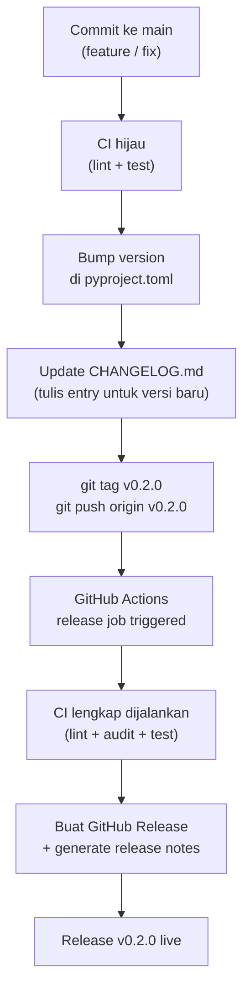

# Release

> Workflow rilis LunaWave — versioning, CHANGELOG, dan GitHub Release.
> Untuk CI yang mentrigger release, lihat → [ci_cd.md](ci_cd.md)
> Untuk proses dari perspektif open source contributor, lihat → [../opensource/release_process.md](../opensource/release_process.md)

---

## Versioning — SemVer

LunaWave menggunakan **Semantic Versioning** (`MAJOR.MINOR.PATCH`):

| Komponen | Kapan Naik | Contoh |
|---|---|---|
| `MAJOR` | Breaking change — API atau behavior berubah tidak backward-compatible | `1.0.0 → 2.0.0` |
| `MINOR` | Fitur baru yang backward-compatible | `0.1.0 → 0.2.0` |
| `PATCH` | Bug fix backward-compatible | `0.1.0 → 0.1.1` |

### Single Source of Truth

Version string disimpan **hanya** di `pyproject.toml`:

```toml
[project]
version = "0.1.0"
```

Tidak ada hardcoded version string di tempat lain. README badge, docs, dan changelog semuanya referensi ke sini.

---

## Alur Release



### Langkah Manual

```bash
# 1. Pastikan main sudah up-to-date dan CI hijau
git checkout main
git pull origin main

# 2. Bump version di pyproject.toml
# Edit: version = "0.2.0"

# 3. Update CHANGELOG.md

# 4. Commit
git add pyproject.toml CHANGELOG.md
git commit -m "chore: release v0.2.0"

# 5. Tag dan push
git tag v0.2.0
git push origin main
git push origin v0.2.0

# → GitHub Actions release job otomatis jalan
```

---

## `release.yml` — GitHub Actions

```yaml
# .github/workflows/release.yml
name: Release

on:
  push:
    tags:
      - "v*.*.*"

jobs:
  release:
    runs-on: ubuntu-latest
    permissions:
      contents: write
    steps:
      - uses: actions/checkout@v4
        with:
          fetch-depth: 0    # butuh history penuh untuk release notes

      - uses: actions/setup-python@v5
        with:
          python-version: "3.11"

      - name: Run full CI before release
        run: |
          pip install -r requirements-dev.txt
          ruff check .
          mypy . --config-file pyproject.toml
          pytest tests/unit/ -v --cov --cov-fail-under=100

      - name: Create GitHub Release
        uses: softprops/action-gh-release@v2
        with:
          generate_release_notes: true
          files: |
            # source tarball (opsional)
```

---

## CHANGELOG.md

Format CHANGELOG mengikuti [Keep a Changelog](https://keepachangelog.com/en/1.1.0/):

```markdown
# Changelog

All notable changes to LunaWave will be documented in this file.

## [Unreleased]

### Added
- ...

### Fixed
- ...

## [0.1.0] - 2024-XX-XX

### Added
- Initial release
- Hexagonal architecture backend
- WebSocket-based playback control
- Radio mode with artist-based prefetching
- PWA frontend with offline support
- SQLite persistence layer
```

### Kategori Standar

| Kategori | Isi |
|---|---|
| `Added` | Fitur baru |
| `Changed` | Perubahan pada fitur yang sudah ada |
| `Deprecated` | Fitur yang akan dihapus di versi mendatang |
| `Removed` | Fitur yang dihapus |
| `Fixed` | Bug fix |
| `Security` | Patch security vulnerability |

---

## Checklist Sebelum Release

- [ ] Semua test lolos (`pytest tests/unit/ --cov-fail-under=100`)
- [ ] Lint bersih (`ruff check .`, `mypy .`)
- [ ] Tidak ada known bug kritis yang belum di-fix
- [ ] `pyproject.toml` version sudah di-bump
- [ ] `CHANGELOG.md` sudah diupdate dengan semua perubahan
- [ ] `README.md` masih akurat (instruksi install, screenshot, dsb.)
- [ ] Tidak ada secret atau credential yang tertinggal di kode

---

## Referensi Terkait

- CI yang menjalankan test sebelum release → [ci_cd.md](ci_cd.md)
- Packaging & version string → [packaging.md](packaging.md)
- Open source release checklist → [../opensource/release_process.md](../opensource/release_process.md)
- ADR yang mendokumentasikan keputusan arsitektur → [../adr/](../adr/)
