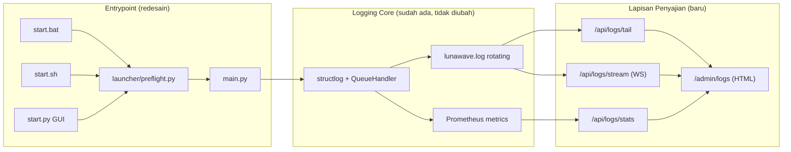

# Proposal Redesign Entrypoint & Dashboard Observability
### LunaWave 2.0.1 → 2.1.0

> **Ringkasan satu paragraf:** Sistem logging inti LunaWave (structlog,
> kategori baku, correlation id, rotasi file, metrics Prometheus) sudah
> solid secara *engineering*. Yang belum ada adalah **permukaan pemakaian**
> — tempat semua informasi berharga itu benar-benar terlihat dan mudah
> dibaca oleh manusia: entrypoint (`start.bat` / `start.sh` / `start.py` /
> `main.py`) yang lebih informatif, dan sebuah **dashboard logging**
> berbasis web. Proposal ini menjelaskan kondisi saat ini, gap-nya, dan
> desain sistem yang diusulkan.

---

## 1. Latar Belakang

LunaWave sudah memiliki fondasi observability yang jauh di atas rata-rata
proyek sejenis:

- Logging terstruktur dengan `structlog`, ditulis ke `lunawave.log`
  (rotating, 1 MB x 2 backup) dan console, lewat `QueueHandler` +
  `QueueListener` agar I/O log tidak memblokir hot path async.
- Taksonomi kategori log yang tertutup dan baku (`core/log_categories.py`):
  `lifecycle`, `session`, `auth`, `command`, `event`, `playback`, `queue`,
  `radio`, `download`, `resolve`, `cache`, `persistence`, `external`,
  `security`, `system`.
- Correlation id per request/sesi WebSocket lewat `structlog.contextvars`,
  sehingga satu request bisa di-*grep* end-to-end.
- Metrics Prometheus (`core/observability.py`): command count & latency,
  event count, active websockets, resolve latency, HTTP requests/bytes,
  WS messages, RSS memory, durasi sesi user aktif.
- Endpoint `/health` (status DB, mpv, uptime, memory, active connections)
  dan `/metrics` (format Prometheus, dibatasi localhost atau token).
- Ada pula RFC internal yang sedang berjalan
  (`docs/rfc/observability_logging/observability_logging.md`, status
  *PLANNING*) yang merencanakan pewarnaan console otomatis, traffic
  middleware terpusat, `server_clock`, dan baris `[STATUS]` periodik.

**Masalahnya:** semua kekayaan data ini saat ini hanya bisa dinikmati lewat
`tail -f lunawave.log` atau `curl /metrics | grep`. Titik masuk aplikasi
(entrypoint) dan tidak adanya dashboard membuat informasi ini terasa
"terkubur" — padahal datanya sudah bagus.

---

## 2. Kondisi Sistem Saat Ini (As-Is)

### 2.1 `start.bat` / `start.sh`

| Yang sudah baik | Yang menjadi gap |
|---|---|
| ASCII banner, deteksi dependency Python, deteksi MPV, cleanup proses lama, info admin access, ringkasan URL (client/admin/health/metrics) | Semua pengecekan (`dependency`, `MPV`, `cleanup port`) hanya tampil di **terminal saat startup**, tidak pernah ditulis ke `lunawave.log` → tidak ada jejak permanen kalau startup gagal di background/service |
| Warna & format rapi di terminal | `start.bat` dan `start.sh` punya dua implementasi paralel yang bisa *drift* (misalnya command health-check Python identik di-duplikasi di kedua file, rawan tidak sinkron saat salah satu diedit) |
| Pesan error `[X] Server terminated with error code: ...` | Tidak ada info **di mana** melihat detail error selain "check application logs" — tidak ada path absolut, tidak ada shortcut untuk membuka dashboard |
| Print URL client/admin/health/metrics | Tidak ada indikasi kondisi *runtime* (apakah port sudah dipakai proses lain sebelum boot benar-benar dimulai, apakah versi Python compatible, dsb) selain teks statis |

### 2.2 `start.py` (GUI launcher)

Hanya membungkus `launcher.__main__.main()` — GUI desktop (Tkinter) untuk
mengelola proses server. Tidak menyalurkan log terstruktur ke tampilan
GUI-nya; pengguna GUI tidak lebih diuntungkan dibanding pengguna CLI dalam
hal observability.

### 2.3 `main.py`

| Yang sudah baik | Yang menjadi gap |
|---|---|
| `setup_logging()` dipanggil sangat awal, `log_session_start()` / `log_session_end()` menandai batas sesi di file log | Banner startup dicetak lewat `print()` biasa (bukan structlog), sehingga baris banner tidak konsisten formatnya dengan baris log lain, dan tidak ikut ter-rotate/tercatat dengan level/kategori |
| `chmod 600` pada `lunawave.log` (keamanan) | Tidak ada ringkasan *shutdown* yang manusiawi — hanya `logger.info("shutdown_completed")`, padahal ini momen bagus untuk menampilkan ringkasan sesi (durasi, jumlah request, error yang terjadi) |
| Task crash pada background task ditangkap & dicatat (`background_task_crashed`) | Tidak ada agregasi: kalau 3 subsistem gagal start (db, mpv, http session), user harus scroll log manual satu-satu untuk tahu urutan kegagalan |

### 2.4 Dashboard / visibilitas log

- **Tidak ada** endpoint atau halaman yang menampilkan isi `lunawave.log`
  secara human-readable di web. Rute yang terdaftar di `server/app.py`
  hanya: `/`, `/admin` (SPA yang sama, untuk player, bukan log),
  `/ws`, `/api/stream/{id}`, `/api/setup-required`, `/health`, `/metrics`.
- `/metrics` adalah format Prometheus mentah — berguna untuk Grafana,
  tapi **tidak enak dibaca manusia langsung** (sesuai keluhan user).
- `/health` hanya snapshot 5 angka, tidak ada histori/trend.
- Tidak ada cara memfilter log berdasarkan kategori (`LC_*`), request id,
  atau level tanpa masuk ke terminal dan `grep` manual.

**Kesimpulan bagian ini:** *mesin* logging sudah profesional; yang belum
ada adalah *jendela* untuk melihatnya. Ibarat mobil dengan sensor
lengkap tapi tanpa dashboard di depan pengemudi.

---

## 3. Sistem yang Diusulkan (To-Be)

### 3.1 Prinsip desain

1. **Tidak mengganti** arsitektur logging yang sudah ada (structlog,
   kategori, correlation id) — hanya menambah lapisan penyajian.
2. **Satu sumber kebenaran** untuk startup checks: logika dependency/MPV
   check dipindah ke satu modul Python (`launcher/preflight.py`, baru),
   dipanggil oleh `start.bat` dan `start.sh` yang keduanya cukup jadi
   *thin wrapper* — menghilangkan duplikasi dan risiko *drift*.
3. **Semua yang tampil di terminal saat startup juga masuk ke
   `lunawave.log`** dengan kategori `LC_LIFECYCLE`, supaya startup yang
   gagal di background/systemd/Termux tetap punya jejak.
4. **Dashboard read-only, aman-default**: mengikuti pola `/metrics` yang
   sudah ada (dibatasi localhost atau token `X-Metrics-Token`), memakai
   koneksi WebSocket yang sudah ada di `server/connection_manager.py`
   untuk live-tail, tanpa dependency baru.

### 3.2 Redesain entrypoint

#### `start.bat` & `start.sh`
- Pindahkan semua pengecekan (deps, MPV, port, cleanup) ke
  `launcher/preflight.py` yang dipanggil satu baris:
  `python -m launcher.preflight`. Skrip shell/batch tinggal menampilkan
  banner ASCII, memanggil preflight, lalu `python main.py`.
- Preflight mencatat setiap langkah ke `lunawave.log`
  (`LC_LIFECYCLE`, event `preflight_check`, field `check`, `result`)
  sekaligus mencetak ke terminal — satu fungsi, dua output.
- Tambahkan baris ringkasan akhir yang menonjol:
  ```
  ================================================================
   Dashboard Logging   : http://localhost:8765/admin/logs
   Client Interface    : http://localhost:8765/
   Admin Interface     : http://localhost:8765/admin
   System Health       : http://localhost:8765/health
   Metrics (Prometheus): http://localhost:8765/metrics
  ================================================================
  ```
- Kode keluar (`errorlevel` / `$?`) yang bukan nol menampilkan **3 baris
  log terakhir** langsung di terminal (bukan cuma "check application
  logs"), diambil dari `lunawave.log` — memangkas waktu debugging.

##### `start.py`
- GUI launcher menambah tombol **"Buka Dashboard Logging"** yang
  membuka `http://<host>:<port>/admin/logs` di browser default,
  sejajar dengan tombol start/stop server yang sudah ada.

#### `main.py`
- Banner startup (`print(...)` manual saat ini) diganti menjadi satu
  pemanggilan `logger.info("startup_summary", category=LC_LIFECYCLE,
  client_url=..., admin_url=..., dashboard_url=..., pid=...)` yang
  dirender oleh `file_renderer`/`console_renderer` yang sudah ada —
  jadi otomatis konsisten format dan otomatis tercatat ke file.
- Saat shutdown, sebelum `log_session_end()`, tambahkan satu event
  ringkasan: `logger.info("session_summary", category=LC_LIFECYCLE,
  duration_seconds=..., total_requests=..., total_errors=...)` — angka
  ini diambil dari counter Prometheus yang **sudah ada**
  (`HTTP_REQUESTS_TOTAL`, dsb), tidak perlu state baru.

### 3.3 Dashboard Logging (baru)

**Rute baru** (menyambung pola proteksi `/metrics` yang sudah ada):

| Rute | Fungsi |
|---|---|
| `GET /admin/logs` | Halaman HTML dashboard (statis, di `web/static/`) |
| `GET /api/logs/tail?limit=200&category=&level=&q=` | Ambil N baris terakhir dari `lunawave.log`, dengan filter kategori/level/kata kunci, hasil sudah di-*parse* jadi JSON |
| `GET /api/logs/stream` (WebSocket, atau reuse `/ws` dengan tipe pesan baru `log_tail`) | Live-tail: baris baru di-push real-time, mengikuti pola `ConnectionManager` yang sudah dipakai untuk player |
| `GET /api/logs/stats` | Ringkasan: jumlah baris per level & kategori dalam 1 jam terakhir, dipakai untuk grafik ringan di dashboard |

**Isi dashboard (satu halaman, tanpa framework baru — vanilla JS,
konsisten dengan `web/static/js/*` yang sudah ada):**

1. **Header status** — reuse data `/health`: status DB/mpv, uptime,
   memory, active connections (kartu ringkas, warna hijau/kuning/merah).
2. **Panel live tail** — daftar baris log terbaru, auto-scroll, tiap
   baris diwarnai sesuai level (skema warna sama seperti
   `_LEVEL_COLORS` di `core/log_config.py` supaya konsisten dengan
   console), badge kategori (`LC_*`) berwarna berbeda per kategori.
3. **Filter bar** — dropdown kategori (15 kategori baku), dropdown level
   (`DEBUG/INFO/WARNING/ERROR/CRITICAL`), search box untuk correlation
   id atau kata kunci bebas.
4. **Panel ringkasan/statistik** — grafik batang sederhana (SVG inline,
   tanpa library chart baru) jumlah log per kategori 1 jam terakhir, plus
   angka dari metrics yang sudah ada (`COMMAND_COUNT`,
   `HTTP_REQUESTS_TOTAL`, `RESOLVE_LATENCY`, dst) ditampilkan sebagai
   angka besar, bukan format Prometheus mentah.
5. **Tombol unduh** — unduh `lunawave.log` mentah (dan 2 backup rotasinya)
   untuk dilampirkan ke laporan bug.

**Keamanan** (mengikuti pola yang sudah ada di `serve_metrics`):
- Dashboard dan seluruh `/api/logs/*` dibatasi ke localhost **atau**
  butuh header `X-Metrics-Token` yang sama dengan yang dipakai `/metrics`
  (`secrets.compare_digest`, sudah ada, tinggal dipakai ulang) — tidak
  perlu sistem auth baru.
- Dashboard log **tidak** menampilkan payload request mentah (body,
  Authorization header, kredensial) — hanya field yang sudah lolos lewat
  `structlog` processor chain, konsisten dengan aturan
  `LOGGING_STANDARD.md` yang melarang mencatat data sensitif mentah.

### 3.4 Diagram Arsitektur (usulan)



---

## 4. Tahapan Implementasi (usulan)

| Tahap | Cakupan | Estimasi kompleksitas |
|---|---|---|
| 1 | `launcher/preflight.py` — satukan logika check dari `start.bat`/`start.sh`, tulis hasil ke log | Kecil |
| 2 | Sederhanakan `start.bat` & `start.sh` jadi thin wrapper, tambah baris ringkasan URL termasuk dashboard | Kecil |
| 3 | `main.py` — ganti `print()` banner jadi `logger.info(...)`, tambah `session_summary` saat shutdown | Kecil |
| 4 | Endpoint `GET /api/logs/tail` + `GET /api/logs/stats` (baca `lunawave.log`, parse baris `file_renderer`, filter) | Sedang |
| 5 | Endpoint `GET /api/logs/stream` (live tail via WebSocket, reuse `ConnectionManager`) | Sedang |
| 6 | Halaman `web/static/admin-logs.html` + JS pendukung (vanilla, mengikuti struktur `web/static/js/`) | Sedang |
| 7 | Tombol "Buka Dashboard Logging" di `start.py` (Tkinter) | Kecil |
| 8 | Update dokumentasi: `LOGGING_STANDARD.md`, `README.md`, `SECURITY.md` (jelaskan proteksi token dashboard) | Kecil |
| 9 | Verifikasi: `automation/doctor.py`, `automation/verify_docs.py`, test unit baru untuk parser `api/logs/tail`, jalankan `start.sh` (Termux) & `start.bat` (Windows) sekali masing-masing | Sedang |

Tahap 1–3 bisa dikerjakan dan dirilis terpisah dari tahap 4–7 (dashboard),
karena keduanya independen — cocok untuk dua sesi kerja terpisah.

---

## 5. Dampak & Risiko

- **Tidak ada dependency baru** — parsing `lunawave.log` cukup pakai
  `re`/string split standar (format `file_renderer` sudah konsisten dan
  dapat diprediksi), live tail cukup pakai `ConnectionManager` yang sudah
  ada.
- **Tidak mengubah** kategori log yang sudah baku (15 kategori) — dashboard
  hanya *membaca*, bukan mengubah taksonomi.
- **Risiko performa**: live tail lewat WebSocket perlu dibatasi rate
  (misalnya batching per 500ms) supaya tidak membanjiri client saat log
  sangat ramai — perlu diperhitungkan di Tahap 5.
- **Risiko keamanan**: dashboard membaca file log mentah, jadi wajib
  memakai proteksi token yang sama seperti `/metrics` sejak hari pertama,
  bukan ditambah belakangan.
- **Kompatibilitas platform**: mengikuti pola `sys.platform == "win32"`
  yang sudah dipakai di `launcher/process.py`, tidak ada kode
  platform-specific baru yang berisiko.

---

## 6. Kesimpulan

LunaWave sudah punya "mesin" logging kelas produksi. Yang diusulkan di
sini murni menambah **lapisan penyajian**: entrypoint yang lebih rapi dan
konsisten (satu sumber kebenaran untuk preflight check), serta dashboard
web read-only untuk melihat log secara langsung, terfilter, dan enak
dibaca — tanpa mengubah arsitektur inti, tanpa dependency baru, dan tetap
mengikuti pola keamanan yang sudah terbukti dipakai di `/metrics`.

---

*Dokumen ini adalah proposal untuk didiskusikan, bukan rencana final.
Estimasi kompleksitas bersifat kualitatif dan perlu divalidasi oleh yang
akan mengerjakan implementasi.*
