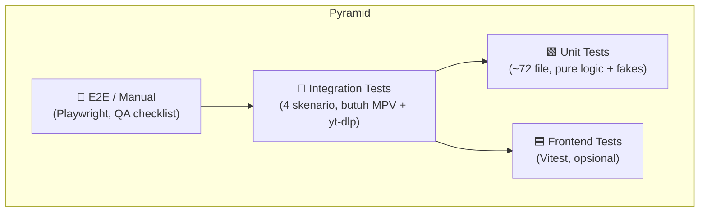

# Testing Strategy

> Filosofi, prioritas, target coverage, dan arsitektur fakes LunaWave.
> Untuk daftar file test per layer, lihat → [unit_testing.md](unit_testing.md)

---

## Filosofi

### Prinsip Utama

**1 file kode testable = 1 file test, mirror path persis.**

Contoh:
```
lunawave/engine/queue_manager.py
→ tests/unit/engine/test_queue_manager.py
```

Tidak ada file test yang menguji lebih dari satu modul.
Tidak ada modul yang diuji oleh lebih dari satu file test.

### Mengapa Mirror Path?

- Mudah menemukan test untuk kode tertentu (dan sebaliknya)
- Coverage gap langsung terlihat — file kode tanpa pasangan = modul belum ditest
- Konsisten dengan konvensi proyek open source besar (Django, FastAPI, dsb.)

---

## Kolom Prioritas

| Prioritas | Artinya | Contoh |
|---|---|---|
| **Tinggi** | Pure logic, tanpa I/O — paling murah, paling bernilai | `command_bus.py`, `track_filter.py` |
| **Sedang** | Perlu fake/mock (port, socket, HTTP, subprocess) | `adapters/mpv/ipc.py`, `server/handlers/websocket.py` |
| **Rendah** | Wiring/bootstrap — cukup smoke test | `server/app.py`, `main.py` |
| **Manual** | GUI Tkinter atau side-effect global — cukup checklist QA | `launcher/gui/app.py`, `start.py` |
| **Opsional** | Script one-off, ROI rendah | `automation/export_to_sqlite.py` |

---

## Target Coverage

**100%** pada semua file yang masuk scope testable.

File kategori `Manual` di-`omit` secara eksplisit di `pyproject.toml` **dengan alasan tertulis** — bukan diam-diam diabaikan.

### Coverage Configuration

Konfigurasi berikut ada di `pyproject.toml`:

```toml
[tool.coverage.run]
omit = [
    "launcher/gui/app.py",       # Tkinter lifecycle — tidak bisa ditest headless
    "launcher/gui/ui_builder.py", # Tkinter widget builder — idem
    "start.py",                   # Entry point OS — side-effect global
]

[tool.coverage.report]
fail_under = 100   # Hanya berlaku untuk file dalam scope (setelah omit)
```

---

## Testing Pyramid



Prioritas eksekusi: **Unit → Integration → Frontend → E2E/Manual**

---

## Fakes

Fakes adalah implementasi palsu dari Ports (interface hexagonal) yang digunakan di seluruh unit test. Tidak ada mock framework yang diperlukan — cukup Python class biasa yang implement protokol yang sama.

### Daftar Fakes

| File | Port yang Diimplementasi | Digunakan Di |
|---|---|---|
| `tests/fakes/fake_audio_player.py` | `AudioPlayerPort` | Test engine, command_router |
| `tests/fakes/fake_media_extractor.py` | `MediaExtractorPort` | Test resolver, searcher |
| `tests/fakes/fake_lyrics_provider.py` | `LyricsProvider` | Test lyrics_sync, lyrics_fetcher |
| `tests/fakes/fake_sponsorblock_provider.py` | `SponsorBlockProvider` | Test sponsorblock |

### Contoh Struktur Fake

```python
# tests/fakes/fake_audio_player.py
from lunawave.core.ports import AudioPlayerPort

class FakeAudioPlayer(AudioPlayerPort):
    def __init__(self):
        self.current_track: str | None = None
        self.is_playing: bool = False
        self.volume: int = 50
        self._call_log: list[tuple] = []

    async def play(self, url: str) -> None:
        self._call_log.append(("play", url))
        self.current_track = url
        self.is_playing = True

    async def pause(self) -> None:
        self._call_log.append(("pause",))
        self.is_playing = False

    async def set_volume(self, level: int) -> None:
        self._call_log.append(("set_volume", level))
        self.volume = level
```

### Keuntungan Fakes atas Mocks

- **Reusable** — satu fake dipakai di banyak test, bukan mock baru tiap test
- **Inspectable** — bisa assert state internal (`fake.is_playing`, `fake._call_log`)
- **Refactor-safe** — perubahan signature Port langsung breaking di fake, bukan silent failure
- **Tidak perlu library** — tidak ada `unittest.mock`, `pytest-mock`, dsb.

---

## Shared Fixtures

`tests/conftest.py` menyediakan fixture bersama:

```python
# tests/conftest.py
import pytest
import aiosqlite

@pytest.fixture
async def db():
    """In-memory SQLite untuk test persistence — tanpa file, tanpa cleanup."""
    async with aiosqlite.connect(":memory:") as conn:
        await run_migrations(conn)
        yield conn

@pytest.fixture
def fake_player():
    return FakeAudioPlayer()

@pytest.fixture
def fake_extractor():
    return FakeMediaExtractor()

@pytest.fixture
async def event_loop_fixture():
    """Shared event loop untuk test asyncio."""
    loop = asyncio.new_event_loop()
    yield loop
    loop.close()
```

---

## Strategi In-Memory SQLite

Untuk test layer `persistence/`, gunakan SQLite `:memory:` — bukan file di disk, bukan database development.

**Keuntungan:**
- Tidak ada state antar test (setiap fixture `db` baru = database kosong)
- Tidak perlu cleanup
- Jauh lebih cepat dari file-based SQLite
- Tidak bergantung pada path filesystem

```python
# Contoh penggunaan di test
async def test_track_repo_save(db):
    repo = TrackRepository(db)
    track = Track(id="1", title="Test", artist="Artist")
    await repo.save(track)
    result = await repo.find_by_id("1")
    assert result == track
```

---

## Referensi Terkait

- Daftar unit test per layer → [unit_testing.md](unit_testing.md)
- Skenario integration test → [integration_testing.md](integration_testing.md)
- Frontend test → [frontend_testing.md](frontend_testing.md)
- Konfigurasi tooling (pyproject.toml) → [../devops/tooling.md](../devops/tooling.md)
- CI yang menjalankan test → [../devops/ci_cd.md](../devops/ci_cd.md)
- Port definitions (yang difake) → [../architecture/domain.md](../architecture/domain.md)
